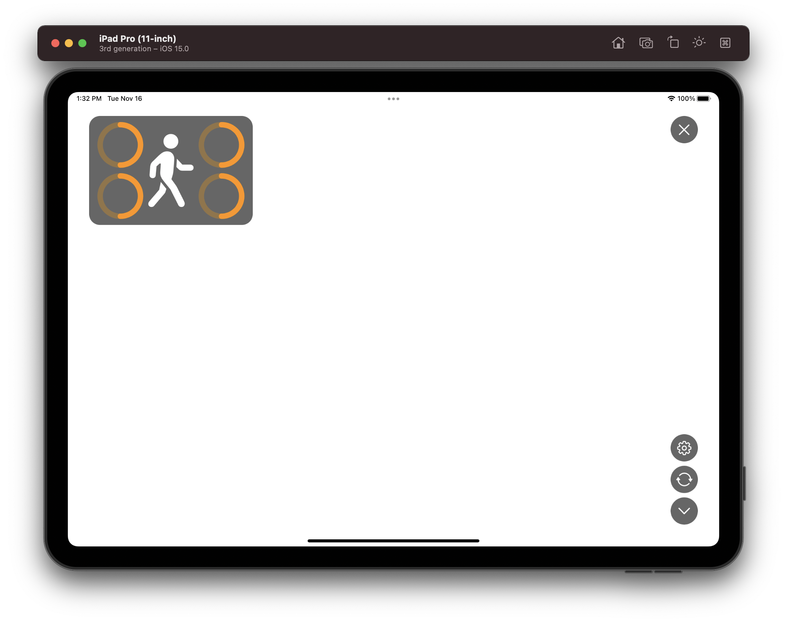
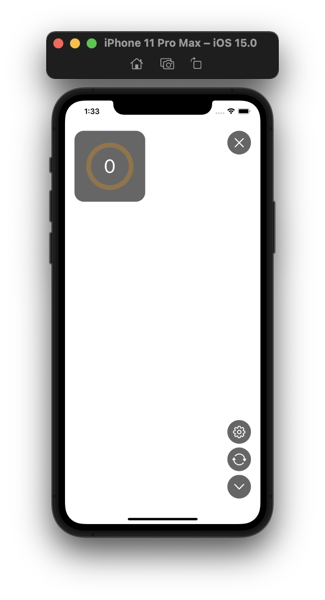

# MoveWithMe

Based on Apple Sample Code [Detecting Human Body Poses in an Image](https://developer.apple.com/documentation/coreml/detecting_human_body_poses_in_an_image){:target="_blank" rel="noopener"}

## Screenshots

